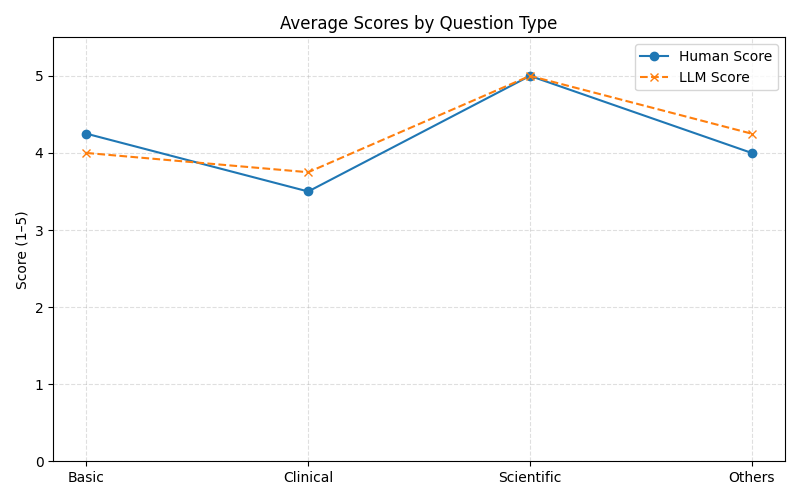

## Evaluation Overview

This evaluation assesses the chatbot’s ability to generate clinically accurate, grounded answers from a HER2 breast cancer paper, using Clinical-Knowledge-Embeddings as the default selected strategy and Mistral-7B as the open source LLM.

**Assumption:** Based on initial testing, Clinical-Knowledge-Embeddings provided the most clinically relevant retrieval results. Thus, evaluation was scoped to this embedding configuration for all 16 queries.

#### Query Augmentation
`Zephyr-7B-Beta` was utilized as a third-party language model for query/data augmentation. 16 queries was generated.

#### LLM-based Scoring and Human-level Scoring
`ChatGPT-4o` was used for automated result scoring. Prompts for query augmentation and auto scoring is under `tests\prompts`. I serve as the domain expert to conduct human-level scoring.

## Test Set
A total of 16 queries were used, balanced across user types. Half of the queries were generated directly, and the other half were semantically augmented to simulate varied user phrasing. Please go to [comprehensive test results](tests/testresults/eval_results.csv) for accessing the comprehensive test results.

| Category          | Example                                    |
|-------------------|--------------------------------------------|
| Basic-Original   | "What is HER2?"                            |
| Basic-Original   | "Is HER2 a gene or a protein?"                            |
| Clinical-Original  | "What treatment options are mentioned for HER2-positive patients?" |
| Clinical-Origiinal  | "How does HER2 amplification affect survival rates?" |
| Scientific-Origiinal  | "How many patients were included in the HER2 study?" |
| Scientific-Origiinal  | "What statistical methods were used to evaluate HER2’s effect on outcomes?" |
| Others-Original | "Who discovered HER2?" |
| Others-Original | "Is HER2 mentioned in the conclusion?" |
| Basic-Augmented   | "What is HER2 and how is it related to breast cancer?"                            |
| Basic-Augmented   | "Can you explain what HER2 amplification means in the context of breast cancer?"                            |
| Clinical-Augmented  | "Which drugs are recommended for HER2-positive breast cancer patients, and at what dosage?" |
| Clinical-Augmented  | "What is the overall survival rate for HER2-positive breast cancer patients after treatment?" |
| Scientific-Augmented  | "How many patients with metastatic breast cancer were included in the HER2 study, and how were they recruited?" |
| Scientific-Augmented  | "Were any adverse events reported during the HER2 study, and how were they managed?" |
| Others-Augmented | "Were any alternative therapies to HER2-targeted treatment tested in the study, and if so, how effective were they?" |
| Others-Augmented | "Did the study mention any potential long-term side effects of HER2-targeted treatment, and how were they monitored?" |

#### Business Metrics
- Mean response time (sec): 50.47 
- Mean LLM-based score (1-5): 4.25
- Mean Human-level score (1-5): 4.19
- Acceptable Answer Rate (Human Score ≥ 4): 81.2%
- Acceptable Answer Rate (LLM ≥ 4): 87.5%

#### Human vs. LLM Score Correlation

To estimate the reliability of using LLM for automatic scoring, Pearson correlation was calculated between human-labeled and LLM-based scores.

- **Correlation**: 0.91

This suggests that LLM-based scoring can be used as a reasonable proxy for expert review in future iterations.

#### Score Comparison by Question Type
To understand the alignment between LLM-based scoring and human evaluation, we grouped the 16 queries into four categories and compared the average scores.

- The LLM and human scores are closely aligned across all categories, with a **strong agreement in scientific questions**.
- The largest deviation appears in **clinical questions**, where the LLM slightly overestimates performance.
- This suggests room for improvement in handling clinical nuance and ambiguity.

## Continuous Improvement Strategy

To ensure the chatbot remains reliable and clinically relevant over time, I propose the following continuous improvement process:

1. **User Feedback Collection**
   - In a production setting, collect explicit feedback (e.g., good or bad buttons) or satisfaction ratings. Buttons can be added into the UI.
   - Capture implicit signals like query rephrasing, follow-up questions, and session abandonment.
2. **Performance Monitoring**
   - Maintain a benchmark test set (e.g., the current 16 queries) for weekly/monthly evaluations.
   - Track KPIs such as accuracy, evidence grounding, and latency over time.
   - Monitor drift in model responses or embedding performance.
3. **Automated Scoring & Review**
   - Use LLM-based scoring as a fast feedback proxy.
   - Periodically compare LLM-based and human scores to maintain alignment.
4. **Embeddings Updates**
   - I have led the efforts to develop node embeddings for the Human Phenotype Ontology (HPO) during my time at Mayo Clinic. The model was named as `HPO2Vec+`. It worth to explore if this work can be incorporated into the knowledge embeddings as a complementary piece.  
 __Shen, Feichen__, et al. "HPO2Vec+: Leveraging heterogeneous knowledge resources to enrich node embeddings for the Human Phenotype Ontology." Journal of 
 biomedical informatics 96 (2019): 103246. [DOI Link](https://www.sciencedirect.com/science/article/pii/S1532046419301650?via%3Dihub)
5. **Answer Quality Audits**
   - Spot-check borderline responses (score 3–4) with clinical experts.
   - Log low-rated queries for retraining or fine-tuning.

This loop establishes a scalable framework for maintaining chatbot quality over time, aligned with real-world user and clinical expectations.
