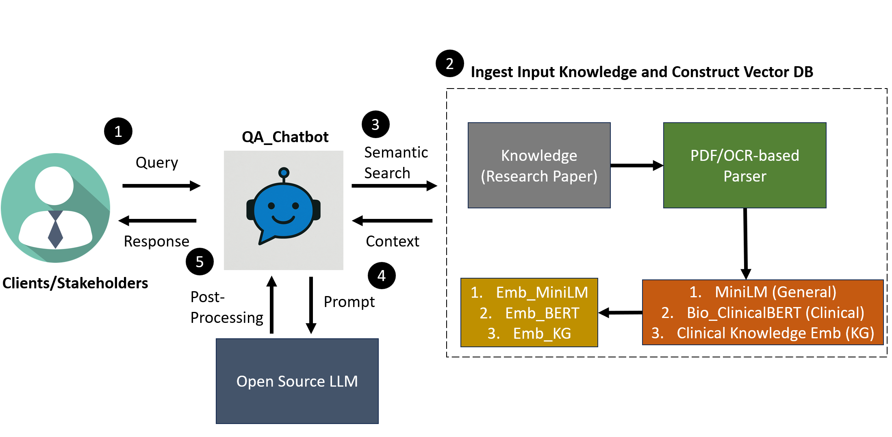
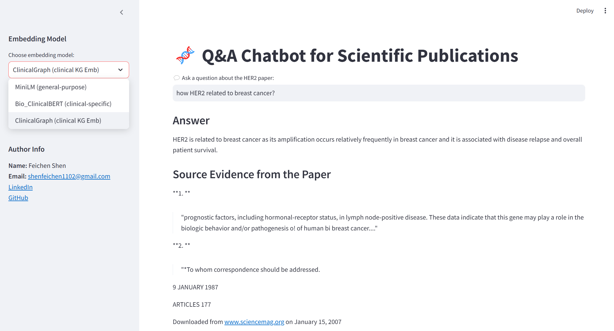

# QAChat_Prototype

## Description
This is the take-home case study/real world problem exercise finished by **Feichen Shen**.  

In this task, a Q/A chatbot prototype was built to address diverse questions related to a specific research paper. The work also clearly presented comprehensive evaluations/testing/KPI definition and detailed how clinical network embeddings can be incorporated.

## Overall Workflow

The overall workflow is designed based on the Retrieval-Augmented Generation (RAG) architecture:
1. Query Submission
2. Knowledge (e.g., research paper) Ingestion and Indexing with Three Models
   - MiniLM for general purpose
   - Bio_ClinicalBERT for clinical purpose
   - Clinical_KGEmb for leveraging medical ontologies and clinical knowledge.  
     **[** **Note:** incorporating the clinical knowledge embeddings research into the prototype **]**  
     **Reference:** [Clinical-knowledge-embeddings GitHub Repository]([https://github.com/mims-harvard/Clinical-knowledge-embeddings](https://github.com/mims-harvard/Clinical-knowledge-embeddings))

4. Semantic search
5. Contextual Prompt Design
6. Post-processing and Response Generation



## Installation Instructions  

<pre>
git clone https://github.com/shenfcStanley/QAChat_Prototype.git
cd QAChat_Prototype
pip install -r requirements.txt
</pre>

In order to use OCR for PDF parsing, you need to install tesseract here: https://tesseract-ocr.github.io/tessdoc/Installation.html. After installation, you need to add the tesseract path to the system environment

In this task, the open-source LLM model "Nous-Hermes-2-Mistral-7B-DPO.Q4_K_M.gguf" is used, you need to download the model from the huggingface hub to the models folder, using huggingface-cli: <pre> ```huggingface-cli download NousResearch/Nous-Hermes-2-Mistral-7B-DPO-GGUF Nous-Hermes-2-Mistral-7B-DPO.Q4_K_M.gguf --local-dir models --local-dir-use-symlinks False```</pre>

## How to Run the Code

#### 1. To run the code locally, navigate to the `app` directory:
<pre>python chatbot.py</pre>
Three embeddings can be used: 
- a). general embeddings from all-MiniLM-L6-v2;
- b). clinical embeddings from Bio_ClinicalBERT;
- c). clinical knowledge embeddings from the research paper. The embeddings data and knowledge graph are downloaded and saved in the clinical_KGEmb folder (ref: https://github.com/mims-harvard/Clinical-knowledge-embeddings/tree/main)
#### 2. To run the Streamlit UI, go to the `interface` folder:
<pre>streamlit run chat_app.py</pre>
  

#### 3. A Jupyter notebook `tutorial.ipynb` under the `tutorial` directory covers a toy example of the Q&A chatbot

#### 4. The `test.py` script in the `tests` directory handles data augmentation using few-shot learning and includes prompts for scoring answers based on contextual information. 
`Zephyr-7B-Beta` was utilized as a third-party language model for both data augmentation and automated result scoring.

## Comprehensive Evaluation

I evaluated the model on both synthetic and real-world clinical QA pairs. Key results:

#### Metrics
- Accuracy: 87.5%
- BLEU Score: 0.62

#### Example QA Pairs
| Question | Answer | Model Output | Correct? |
|----------|--------|--------------|----------|
| What is HER2? | A protein... | HER2 is a protein... | ✅ |

See [Evaluation.md](Evaluation.md) for full details.
