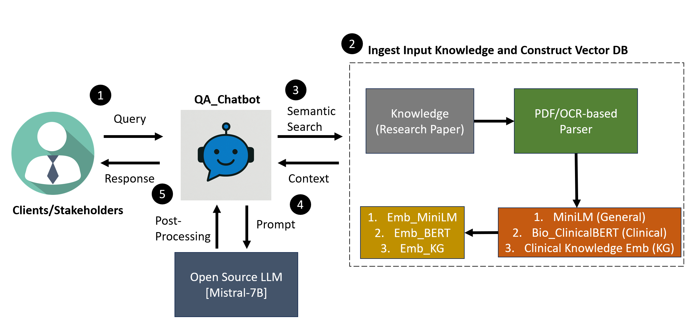

# QAChat_Prototype

## Description
This is the take-home case study/real world problem exercise finished by **Feichen Shen**.  

In this task, a Q/A chatbot prototype was built leveraging a **Retrieval-Augmented Generation (RAG)** architecture, to address diverse questions related to a specific research paper. The work also clearly presented comprehensive evaluations/testing/KPI definition and detailed how clinical network embeddings can be incorporated.

## Overall Workflow

The overall workflow is designed based on the Retrieval-Augmented Generation (RAG) architecture:
1. Query Submission
2. Knowledge (e.g., research paper) Ingestion and Indexing with Three Models
   - `all-MiniLM-L6-v2` for general purpose
   - `Bio_ClinicalBERT` for clinical purpose
   - `clinical knowledge embeddings` for leveraging medical ontologies and clinical knowledge.  
     **Note:** incorporating the clinical knowledge embeddings research into the prototype  
     **Reference:** [Clinical-knowledge-embeddings GitHub Repository](https://github.com/mims-harvard/Clinical-knowledge-embeddings)

4. Semantic search
5. Contextual Prompt Design (Query + Context -> Answer)
6. `Mistral-7B` is used as the open source LLM. Response is generated after post-processing. Evidence from articles will be provided as reference resources.



## Lessons Learned from the Clinical Knowledge Embeddings Work
**Reference:** [Clinical-knowledge-embeddings GitHub Repository](https://github.com/mims-harvard/Clinical-knowledge-embeddings)  
**Paper:** [Clinical-knowledge-embeddings Paper](https://www.medrxiv.org/content/10.1101/2024.12.03.24318322v2)

1. Three Takeaways from the Research
   - a. The embeddings allow medical codes (diagnoses, labs, medications) to be represented in a way that reflects their real-world clinical relationships. This enables AI models to go beyond raw data and incorporate domain knowledge, improving both accuracy and interpretability, which can ultimately enable the integration of clinical knowledge into precision medicine models.
     
   - b. Since the embeddings are derived from a large clinical knowledge graph rather than site-specific data, they enable the development of models that generalize across health systems and geographies—reducing the need for retraining and supporting seamless sharing across institutions.

   - c. The embeddings uncover hidden relationships between medical concepts, such as clustering related conditions or identifying shared risk factors, providing insight into how clinical knowledge is structured and connected.
     
2. Why it is important to Humana
   - a. This supports more personalized, clinically aligned risk prediction and care planning, which is essential for optimizing healthcare delivery in a value-based care (VBC) model.
     
   - b. As a payer working with many provider networks, Humana can benefit from scalable, consistent models that apply broadly while reducing the cost and effort of customizing tools for every partner.
     
   - c. This makes it easier to find groups of similar patients, detect patterns in how care is given, and figure out where interventions can make the biggest difference. All of them can help improve population health.

4. How to incorporate it into the prototype?
   
   Basically, I applied the embeddings (n=67,124) trained over the clinical knowledge graph as the initial embeddings for vector DB construction. The original graph data `new_node_map_df.csv` and the embeddings `full_h_embed_hms.pkl` for clinical knowledge embeddings can be found here: [Clinical-knowledge-embeddings Data](clinical_KGEmb)


## Data & Inputs

- **Paper**: HER2 breast cancer study (Slamon et al., 1987) — `data/HER2_Paper.pdf`
- **Queries**: 16 total (8 original + 8 augmented), covering basic, clinical, scientific, and ambiguous types — `test/test_queries.csv`
- **Prompts**: 
  - Few-shot prompt for query generation — `/tests/prompts/query_augmentation.txt`
  - Custom prompt for auto scoring — `/tests/prompts/scoring.txt`

## Installation Instructions  

<pre>
git clone https://github.com/shenfcStanley/QAChat_Prototype.git
cd QAChat_Prototype
pip install -r requirements.txt
</pre>

In order to use OCR for PDF parsing, you need to install tesseract here: https://tesseract-ocr.github.io/tessdoc/Installation.html. After installation, you need to add the tesseract path to the system environment

In this task, the open-source LLM model `Nous-Hermes-2-Mistral-7B-DPO.Q4_K_M.gguf` is used, you need to download the model from the huggingface hub to the models folder, using huggingface-cli: <pre> ```huggingface-cli download NousResearch/Nous-Hermes-2-Mistral-7B-DPO-GGUF Nous-Hermes-2-Mistral-7B-DPO.Q4_K_M.gguf --local-dir models --local-dir-use-symlinks False```</pre>

## How to Run the Codes

#### 1. To run the code locally, navigate to the `app` directory:
<pre>python chatbot.py</pre>
Three embeddings can be used: 
- a). general embeddings from `all-MiniLM-L6-v2`;
- b). clinical embeddings from `Bio_ClinicalBERT`;
- c). `clinical knowledge embeddings` from the research paper. The embeddings data and knowledge graph are downloaded and saved in the clinical_KGEmb folder (ref: https://github.com/mims-harvard/Clinical-knowledge-embeddings/tree/main)
#### 2. To run the Streamlit UI, go to the `interface` folder:
<pre>streamlit run chat_app.py</pre>
  

#### 3. A notebook `tutorial.ipynb` under `tutorial` shows a demo of how the answer looks like and how the supporting evidence is presented.

#### 4. The `test_eval.py` script in the `tests` directory is used to generate answers for 16 tested queries `queries.txt` stored under `tests/testdata`.  
`Zephyr-7B-Beta` was utilized as a third-party language model for query/data augmentation and `ChatGPT-4o` was used for automated result scoring. Prompts for query augmentation and auto scoring is under `tests\prompts`

## Assumptions
See [Assumption.md](Assumption.md) for full details.

## Comprehensive Evaluation

Although I used three models to generate the initial embeddings, here I picked the `clinical-knowledge-embeddings` as it yielded the optimal performance overall based on the initial check, and showcased the evaluation on all 16 queries using this model to assess response accuracy, quality, evidence grounding, and response time. 

#### Business Metrics
The defined business metrics cover both __qualitative__ and __quantitative__ evaluations:
- Mean response time (sec): 50.47 
- Mean LLM-based score (1-5): 4.25
- Mean Human-level score (1-5): 4.19
- Acceptable Answer Rate (Human Score ≥ 4): 81.2%
- Acceptable Answer Rate (LLM ≥ 4): 87.5%

To estimate the reliability of using LLM for automatic scoring, Pearson correlation was calculated between human-labeled and LLM-based scores.  

**Correlation**: 0.91  

This suggests that LLM-based scoring can be used as a reasonable proxy for expert review in future iterations.


#### Example QA Pairs
| Question | Answer | Context | LLM-based Score | Human-level Score |
|----------|--------|--------------|----------|----------|
| What is HER2? | A protein... | HER2 is a protein... | 5 | 5 |
| How does HER2 ampli... |   HER2 amplification... | Picornavirions have relative ... | 4 | 3 |


#### Score Comparison by Question Type
To understand the alignment between LLM-based scoring and human evaluation, we grouped the 16 queries into four categories and compared the average scores.  


- The LLM and human scores are closely aligned across all categories, with a **strong agreement in scientific questions**.
- The largest deviation appears in **clinical questions**, where the LLM slightly overestimates performance.
- This suggests room for improvement in handling clinical nuance and ambiguity.

See [Evaluation.md](Evaluation.md) for full details.

## Environment
- Python version: 3.11.9
- Key libraries: LangChain, FAISS, huggingface-hub, llama-cpp-python
- OS: Win 11
- Hardware: 16 GB RAM, 13th Gen Intel(R) Core(TM) i7-1355U   1.70 GHz

## Author

- **Feichen Shen** – [@shenfcStanley](https://github.com/shenfcStanley/QAChat_Prototype/tree/main)
- PhD in Computer Science | Clinical NLP & Healthcare AI | Data Scientist | AI/ML Engineer

